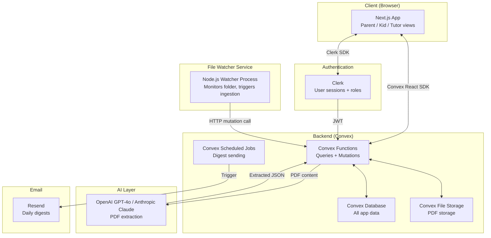

# PRD — ULTISchoolPulse

## 1. Overview

### Product Summary

**ULTISchoolPulse** turns your school's daily WhatsApp PDFs into organized homework trackers, lesson summaries, and exam alerts for parents, kids, and home tutors.

Schools send daily transaction PDFs via WhatsApp detailing homework, classwork, and upcoming exams. ULTISchoolPulse monitors a designated folder for new PDFs, uses AI to extract structured data regardless of the school's format, and presents this as per-stakeholder dashboards and daily email digests — requiring nothing from the school and minimal effort from the parent.

### Objective

This PRD covers the ULTISchoolPulse MVP: a web application buildable in 4–8 weeks by a solo developer. Scope includes PDF folder monitoring, AI extraction of homework/classwork/exam data, a parent dashboard, a daily email digest, multi-child support, and basic authentication. The kid view and tutor view are P1 features included in this spec but may ship in the iteration after initial parent dashboard validation.

### Market Differentiation

Every institutional school communication tool requires the school to adopt a new platform. ULTISchoolPulse works entirely on the family side, using what the school already sends. The technical implementation must deliver this promise: AI parsing that handles varied PDF layouts without manual template setup, and a folder-watch intake mechanism that requires only a 2-tap Share action from the parent.

### Magic Moment

A parent opens their morning digest email and in under 10 seconds knows tonight's homework and the next upcoming exam — without opening a single PDF. For this to work: PDF processing must complete within 90 seconds of file detection, extraction accuracy must be high enough that the parent trusts the digest, and the digest email must be scannable in under 30 seconds. Onboarding to magic moment must be achievable within 24 hours of signup.

### Success Criteria

- PDF drop to dashboard update: ≤90 seconds
- AI extraction accuracy on test set of 5+ school formats: ≥90% correct field extraction
- Daily digest email open rate: ≥60% in first 30 days
- Onboarding completion rate (account created → first PDF processed): ≥70%
- Page load (LCP): <2 seconds on 3G
- Zero silent extraction failures — all low-confidence extractions surface a warning

---

## 2. Technical Architecture

### Architecture Overview



### Chosen Stack

| Layer | Choice | Rationale |
|---|---|---|
| Frontend | Next.js (App Router) | Best ecosystem for rapid dashboard development, excellent Convex integration, deploys to Vercel with zero config |
| Backend | Convex | Real-time reactive queries for multi-user family view, built-in file storage for PDFs, TypeScript end-to-end, zero boilerplate |
| Database | Convex Database | Included with Convex, automatic indexing, ACID transactions, reactive queries |
| Auth | Clerk | Fast setup, pre-built UI, supports family/multi-user structures, generous free tier |
| Payments | None (MVP) | Free during personal use and beta. Polar added post-beta. |
| AI | OpenAI GPT-4o or Anthropic Claude API | Handles varied PDF formats intelligently |
| Email | Resend | Simple API, great deliverability, generous free tier (3,000 emails/month) |
| File Watcher | Node.js (chokidar) | Monitors the designated folder for new PDFs, calls Convex HTTP action to trigger processing |

### Stack Integration Guide

**Setup order:**
1. Initialize Next.js with App Router and TypeScript: `npx create-next-app@latest ultischoolpulse --typescript --app`
2. Install and configure Convex: `npx convex dev` — this creates the `convex/` directory and sets up the development backend
3. Install and configure Clerk — create application at clerk.com, install `@clerk/nextjs`, wrap the app in `<ClerkProvider>` in `app/layout.tsx`
4. Connect Clerk to Convex by setting `CONVEX_AUTH_ADAPTER=clerk` in the Convex dashboard and using `auth.getUserIdentity()` in Convex functions
5. Install Resend: `npm install resend` — create API key at resend.com, add to env
6. Install OpenAI SDK: `npm install openai` — add API key to env
7. Install PDF processing: `npm install pdf-parse` for text extraction, `npm install sharp` for image-based PDFs
8. Set up the file watcher as a separate Node.js process: `npm install chokidar`

**Known integration patterns:**
- Clerk + Convex: Use `useConvexAuth()` hook from `convex/react` to get auth state. In Convex functions, use `ctx.auth.getUserIdentity()` to get the current user's Clerk ID (`subject` field). Store this as `clerkId` in the users table for cross-referencing.
- Convex file storage: Upload PDFs using `useStorageUpload()` hook or from the watcher via HTTP action. Retrieve with `ctx.storage.getUrl(storageId)`.
- Convex HTTP actions: Used by the file watcher to trigger PDF processing. Define in `convex/http.ts`. The watcher sends a POST with the file content as FormData.
- Convex scheduled functions: Use `ctx.scheduler.runAfter()` for triggering digest sending at a set time daily. Use `cronJobs` in `convex/crons.ts` for repeating schedules.

**Required environment variables:**
```
# Next.js (.env.local)
NEXT_PUBLIC_CONVEX_URL=           # From Convex dashboard
NEXT_PUBLIC_CLERK_PUBLISHABLE_KEY=
CLERK_SECRET_KEY=

# Convex (.env in convex/ or Convex dashboard environment variables)
CLERK_JWT_ISSUER_DOMAIN=          # From Clerk dashboard
OPENAI_API_KEY=                   # Or ANTHROPIC_API_KEY
RESEND_API_KEY=
RESEND_FROM_EMAIL=digest@ultischoolpulse.com

# File watcher (.env or process env)
WATCHED_FOLDER_PATH=              # Absolute path to monitored folder
CONVEX_HTTP_ACTION_URL=           # Convex HTTP action endpoint
CONVEX_DEPLOY_KEY=                # For watcher auth to Convex
```

**Common gotchas:**
- Convex functions cannot access the filesystem — PDF processing must happen via HTTP actions that receive file content from the watcher
- PDF text extraction (`pdf-parse`) fails on image-only PDFs — always fall back to vision model (GPT-4o with image input) if text extraction returns empty or near-empty string
- Clerk user IDs are strings in the format `user_xxxxx` — store them as strings in Convex, not as Convex IDs
- Convex mutations are transactional but Convex actions are not — use actions for AI API calls (external side effects), mutations for database writes after extraction is complete

### Repository Structure

```
ultischoolpulse/
├── app/                              # Next.js App Router
│   ├── layout.tsx                    # Root layout with ClerkProvider + ConvexProvider
│   ├── page.tsx                      # Landing page (public)
│   ├── sign-in/[[...sign-in]]/
│   │   └── page.tsx                  # Clerk sign-in page
│   ├── sign-up/[[...sign-up]]/
│   │   └── page.tsx                  # Clerk sign-up page
│   ├── (dashboard)/                  # Authenticated route group
│   │   ├── layout.tsx                # Dashboard shell (nav + sidebar)
│   │   ├── dashboard/
│   │   │   └── page.tsx              # Parent dashboard (default view)
│   │   ├── kid/
│   │   │   └── page.tsx              # Kid view
│   │   ├── tutor/
│   │   │   └── page.tsx              # Tutor view
│   │   ├── exams/
│   │   │   └── page.tsx              # Full exam schedule view
│   │   ├── history/
│   │   │   └── page.tsx              # Historical classwork/homework log
│   │   ├── settings/
│   │   │   └── page.tsx              # Account settings, child management
│   │   └── children/
│   │       └── [childId]/
│   │           └── page.tsx          # Per-child detail view
├── components/
│   ├── ui/                           # Design system primitives
│   │   ├── button.tsx
│   │   ├── card.tsx
│   │   ├── badge.tsx
│   │   ├── skeleton.tsx
│   │   ├── toast.tsx
│   │   └── ...
│   └── features/                     # Feature-specific components
│       ├── homework-card.tsx          # Individual homework item card
│       ├── exam-card.tsx              # Exam/slip test card with countdown
│       ├── subject-tag.tsx            # Subject pill badge
│       ├── parse-status-banner.tsx    # Low-confidence warning banner
│       ├── digest-preview.tsx         # Preview of what tonight's digest will say
│       ├── child-switcher.tsx         # Switch between children
│       └── pdf-drop-instructions.tsx  # Onboarding instructions
├── lib/
│   ├── utils.ts                       # cn(), date helpers, etc.
│   ├── email-templates/
│   │   └── daily-digest.tsx           # React Email template for digest
│   └── constants.ts                   # Shared constants
├── convex/
│   ├── schema.ts                      # Convex database schema (source of truth)
│   ├── auth.config.ts                 # Clerk auth configuration
│   ├── http.ts                        # HTTP actions (PDF ingestion endpoint)
│   ├── crons.ts                       # Scheduled jobs (digest sending)
│   ├── users.ts                       # User queries and mutations
│   ├── children.ts                    # Child management
│   ├── schoolEntries.ts               # School PDF entry queries
│   ├── homework.ts                    # Homework queries
│   ├── exams.ts                       # Exam/slip test queries
│   ├── extraction.ts                  # AI extraction action
│   └── digests.ts                     # Digest scheduling and sending
├── watcher/
│   ├── index.ts                       # File watcher process (runs separately)
│   ├── upload.ts                      # Upload PDF to Convex HTTP action
│   └── package.json                   # Separate package for watcher dependencies
├── public/
│   └── ...
├── .env.local
├── next.config.ts
├── tailwind.config.ts
├── tsconfig.json
└── package.json
```

### Infrastructure & Deployment

**Frontend:** Deploy to Vercel. Connect the GitHub repo and Vercel auto-deploys on push to main. Set all environment variables in the Vercel dashboard.

**Backend:** Convex is self-hosting in Convex Cloud. Run `npx convex deploy` to deploy backend functions. Convex handles scaling, backups, and uptime.

**File watcher:** For MVP, run the watcher process locally on the parent's machine (or a lightweight VPS). This is the only component that requires ongoing host infrastructure. A cheap VPS ($5/month, DigitalOcean or Railway) is sufficient for beta. In v2, replace with a proper upload mechanism.

**Environment variables in Vercel:** Add `NEXT_PUBLIC_CONVEX_URL`, `NEXT_PUBLIC_CLERK_PUBLISHABLE_KEY`, `CLERK_SECRET_KEY`.

**Environment variables in Convex dashboard:** Add `CLERK_JWT_ISSUER_DOMAIN`, `OPENAI_API_KEY`, `RESEND_API_KEY`, `RESEND_FROM_EMAIL`.

### Security Considerations

- All Convex queries and mutations authenticate via Clerk JWT. Use `ctx.auth.getUserIdentity()` at the top of every authenticated function and throw an error if null.
- Users can only access data belonging to their own account. Always filter queries with `where clerkId === identity.subject`.
- PDF files stored in Convex file storage are accessed via short-lived signed URLs — never expose raw storage IDs to the client without validation.
- The HTTP action endpoint for PDF ingestion requires a `CONVEX_DEPLOY_KEY` bearer token to prevent unauthorized uploads.
- Input validation: use Zod schemas on all form inputs and Convex arg validators (`v.string()`, `v.id()`, etc.) on all function args. No raw string concatenation in queries.
- Rate limit PDF processing: maximum 10 PDFs per account per hour to prevent AI API cost explosion.

### Cost Estimate (Monthly, first 6 months, <100 users)

| Service | Free Tier | Estimated Usage | Cost |
|---|---|---|---|
| Vercel | 100GB bandwidth/month | Well within free | $0 |
| Convex | 1M function calls, 1GB storage | Well within free at beta | $0 |
| Clerk | 10,000 MAU | Well within free | $0 |
| OpenAI GPT-4o | — | ~$0.005/PDF × 5 PDFs/week × 50 families × 4 weeks = ~$5/month | ~$5 |
| Resend | 3,000 emails/month free | 50 families × 30 days = 1,500 emails/month | $0 |
| VPS (watcher) | — | DigitalOcean $4/month droplet | $4 |
| **Total** | | | **~$9/month** |

---

## 3. Data Model

### Entity Definitions

```typescript
// convex/schema.ts

import { defineSchema, defineTable } from "convex/server";
import { v } from "convex/values";

export default defineSchema({

  // Users — one per parent account (or tutor account)
  users: defineTable({
    clerkId: v.string(),           // Clerk user ID ("user_xxxxx"), unique
    email: v.string(),             // From Clerk
    name: v.string(),              // Display name
    role: v.union(
      v.literal("parent"),
      v.literal("tutor")
    ),
    digestTime: v.string(),        // "morning" | "evening", default "morning"
    digestEnabled: v.boolean(),    // Whether to send daily digest
    createdAt: v.number(),         // Unix timestamp (ms)
  }).index("by_clerkId", ["clerkId"]),

  // Children — a child belongs to one parent, can have multiple tutors
  children: defineTable({
    parentId: v.id("users"),       // Reference to parent user
    name: v.string(),              // Child's name
    schoolName: v.string(),        // School name (for display)
    grade: v.optional(v.string()), // e.g. "Grade 5"
    tutorIds: v.array(v.id("users")), // Tutors linked to this child
    watchedFolderPath: v.optional(v.string()), // Local path (metadata only)
    createdAt: v.number(),
  }).index("by_parentId", ["parentId"]),

  // PDF ingestion records — one per PDF processed
  schoolEntries: defineTable({
    childId: v.id("children"),
    parentId: v.id("users"),       // Denormalized for query efficiency
    fileStorageId: v.id("_storage"), // Convex file storage ID
    fileName: v.string(),
    entryDate: v.string(),         // "YYYY-MM-DD" — the school day this PDF covers
    processingStatus: v.union(
      v.literal("pending"),
      v.literal("processing"),
      v.literal("complete"),
      v.literal("failed"),
      v.literal("low_confidence")  // Parsed but confidence below threshold
    ),
    extractionConfidence: v.optional(v.number()), // 0-1 float
    rawExtractedJson: v.optional(v.string()),      // Raw AI output (stringified JSON)
    errorMessage: v.optional(v.string()),
    createdAt: v.number(),
    processedAt: v.optional(v.number()),
  })
    .index("by_childId", ["childId"])
    .index("by_parentId_and_date", ["parentId", "entryDate"])
    .index("by_status", ["processingStatus"]),

  // Homework items — extracted from school PDFs
  homeworkItems: defineTable({
    schoolEntryId: v.id("schoolEntries"),
    childId: v.id("children"),
    parentId: v.id("users"),       // Denormalized
    subject: v.string(),           // e.g. "Mathematics", "Science"
    description: v.string(),       // e.g. "Complete exercises 5–10 on page 42"
    dueDate: v.string(),           // "YYYY-MM-DD" — when homework is due
    assignedDate: v.string(),      // "YYYY-MM-DD" — when it was assigned
    isComplete: v.boolean(),       // Parent/kid can mark complete
    completedAt: v.optional(v.number()),
    createdAt: v.number(),
  })
    .index("by_childId_and_dueDate", ["childId", "dueDate"])
    .index("by_schoolEntryId", ["schoolEntryId"]),

  // Classwork items — what was taught/covered in class
  classworkItems: defineTable({
    schoolEntryId: v.id("schoolEntries"),
    childId: v.id("children"),
    parentId: v.id("users"),
    subject: v.string(),
    topicsCovered: v.array(v.string()), // e.g. ["Photosynthesis", "Chloroplasts"]
    notes: v.optional(v.string()),       // Additional context from PDF
    entryDate: v.string(),              // "YYYY-MM-DD"
    createdAt: v.number(),
  })
    .index("by_childId_and_date", ["childId", "entryDate"])
    .index("by_schoolEntryId", ["schoolEntryId"]),

  // Exam / slip test items
  examItems: defineTable({
    schoolEntryId: v.id("schoolEntries"), // Which PDF announced this
    childId: v.id("children"),
    parentId: v.id("users"),
    subject: v.string(),
    examType: v.union(
      v.literal("slip_test"),
      v.literal("unit_test"),
      v.literal("exam"),
      v.literal("quiz"),
      v.literal("other")
    ),
    examDate: v.string(),               // "YYYY-MM-DD"
    portions: v.array(v.string()),      // e.g. ["Chapter 4", "Chapter 5", "Pg 32-45"]
    notes: v.optional(v.string()),
    announcedDate: v.string(),          // "YYYY-MM-DD" — when announced
    isAcknowledged: v.boolean(),        // Parent has seen it
    createdAt: v.number(),
  })
    .index("by_childId_and_examDate", ["childId", "examDate"])
    .index("by_childId_upcoming", ["childId", "examDate"]),

  // Digest log — record of sent digests
  digestLog: defineTable({
    parentId: v.id("users"),
    sentAt: v.number(),
    digestDate: v.string(),            // "YYYY-MM-DD" — which day's digest
    emailStatus: v.union(
      v.literal("sent"),
      v.literal("failed")
    ),
    childrenIncluded: v.array(v.id("children")),
    itemCount: v.number(),             // Total homework + exam items included
  }).index("by_parentId", ["parentId"]),

});
```

### Relationships

- `users` 1:many `children` — one parent has multiple children
- `children` many:many `users` (tutors) — through `children.tutorIds` array
- `children` 1:many `schoolEntries` — one child has many PDF ingestion records
- `schoolEntries` 1:many `homeworkItems`, `classworkItems`, `examItems` — one PDF produces multiple extracted items
- `users` 1:many `digestLog` — one parent has many digest records

### Indexes

All indexes defined inline in schema.ts above. Key query patterns:

- `by_clerkId` on users — auth lookup on every request
- `by_parentId` on children — list all children for a parent
- `by_childId_and_dueDate` on homeworkItems — "what's due today/this week?"
- `by_childId_upcoming` on examItems — "what exams are coming up?"
- `by_childId_and_date` on classworkItems — "what was covered this week?"
- `by_status` on schoolEntries — find pending/failed entries for retry logic

---

## 4. API Specification

### API Design Philosophy

ULTISchoolPulse uses Convex queries and mutations exclusively for client-server communication. No REST API is exposed to the browser client — all data access goes through the Convex React SDK's `useQuery()` and `useMutation()` hooks, which provide real-time reactivity automatically.

HTTP actions (`convex/http.ts`) are used only for the file watcher → Convex ingestion path, which requires a non-Convex client to submit data.

Error handling convention: Convex functions throw `ConvexError` with a message string for user-facing errors. The client catches these and displays them in toast notifications.

### Endpoints

**Users**

```typescript
// queries/mutations in convex/users.ts

query("users.getCurrent", {
  args: {},
  handler: async (ctx) => {
    const identity = await ctx.auth.getUserIdentity();
    if (!identity) return null;
    return await ctx.db.query("users")
      .withIndex("by_clerkId", q => q.eq("clerkId", identity.subject))
      .unique();
  }
})

mutation("users.upsert", {
  args: {
    name: v.string(),
    email: v.string(),
    role: v.union(v.literal("parent"), v.literal("tutor")),
  },
  handler: async (ctx, args) => {
    // Called on first sign-in to create or update user record
  }
})

mutation("users.updateDigestSettings", {
  args: {
    digestTime: v.union(v.literal("morning"), v.literal("evening")),
    digestEnabled: v.boolean(),
  }
})
```

**Children**

```typescript
query("children.list", {
  args: {},
  returns: v.array(v.object({ ... })),
  // Returns all children for the current parent
})

mutation("children.create", {
  args: {
    name: v.string(),
    schoolName: v.string(),
    grade: v.optional(v.string()),
  },
  returns: v.id("children"),
})

mutation("children.update", {
  args: {
    childId: v.id("children"),
    name: v.optional(v.string()),
    schoolName: v.optional(v.string()),
    grade: v.optional(v.string()),
  }
})

mutation("children.addTutor", {
  args: {
    childId: v.id("children"),
    tutorEmail: v.string(),
    // Looks up tutor by email, adds to tutorIds array
  }
})
```

**School Entries (PDF ingestion)**

```typescript
// HTTP Action — called by file watcher
// POST /ingest-pdf
// Headers: Authorization: Bearer {CONVEX_DEPLOY_KEY}
// Body: FormData with fields: childId, fileName, fileContent (base64 or binary)
httpAction("ingest-pdf", async (ctx, request) => {
  // 1. Validate auth header
  // 2. Store PDF in Convex file storage
  // 3. Create schoolEntry with status: "pending"
  // 4. Schedule extraction action
  // Returns: { entryId, status: "queued" }
})

query("schoolEntries.listForChild", {
  args: { childId: v.id("children"), limit: v.optional(v.number()) },
  // Returns recent entries with processing status
})

action("schoolEntries.processEntry", {
  args: { entryId: v.id("schoolEntries") },
  // 1. Retrieve PDF from storage
  // 2. Extract text with pdf-parse
  // 3. If text is sparse, use vision model
  // 4. Call AI extraction prompt
  // 5. Parse JSON response
  // 6. If confidence >= 0.85: create homework/classwork/exam items, mark complete
  // 7. If confidence < 0.85: mark low_confidence, store raw JSON, notify parent
})
```

**Homework**

```typescript
query("homework.forChildToday", {
  args: { childId: v.id("children"), date: v.string() },
  // Returns homeworkItems where dueDate === date
})

query("homework.forChildThisWeek", {
  args: { childId: v.id("children"), startDate: v.string(), endDate: v.string() },
})

mutation("homework.markComplete", {
  args: { homeworkId: v.id("homeworkItems"), isComplete: v.boolean() }
})
```

**Exams**

```typescript
query("exams.upcoming", {
  args: { childId: v.id("children"), daysAhead: v.optional(v.number()) },
  // Returns examItems where examDate >= today, ordered by examDate ASC
  // daysAhead defaults to 14
})

mutation("exams.acknowledge", {
  args: { examId: v.id("examItems") }
})
```

**Classwork**

```typescript
query("classwork.forChildThisWeek", {
  args: { childId: v.id("children"), startDate: v.string(), endDate: v.string() },
})
```

**Digests**

```typescript
// Convex cron job — runs daily at 6am and 8pm UTC (covers morning/evening preferences)
cronJob("digests.sendScheduled", {
  // For each parent with digestEnabled: true
  // Check digestTime preference
  // Gather today's homework + upcoming exams within 7 days
  // Build digest email content
  // Send via Resend
  // Log in digestLog
})
```

---

## 5. User Stories

### Epic: Authentication & Onboarding

**US-001: Account Creation**
As a parent, I want to sign up with my email so that I can create my family's account.

Acceptance Criteria:
- [ ] Given I visit the sign-up page, when I enter my email and password, then a Clerk account is created and I am redirected to the onboarding flow
- [ ] Given I have a Google account, when I click "Sign in with Google," then I am authenticated and redirected to onboarding
- [ ] Edge case: Existing email → show "account already exists, sign in instead"

**US-002: Child Setup**
As a parent, I want to add my children and their school names so that ULTISchoolPulse knows whose data to track.

Acceptance Criteria:
- [ ] Given I complete account creation, when I reach onboarding step 2, then I can add a child's name, school name, and grade
- [ ] Given I've added one child, when I click "Add another child," then a second child form appears
- [ ] Given I complete child setup, when I proceed, then I see the folder setup instructions screen

**US-003: Folder Setup Instructions**
As a parent, I want clear instructions on how to share PDFs to the monitored folder so that I can start using the app.

Acceptance Criteria:
- [ ] Given I complete onboarding, when I reach the folder step, then I see step-by-step instructions with screenshots for both Android and iOS WhatsApp share flows
- [ ] Given the instructions screen is shown, when I click "I've set it up," then I am taken to the main dashboard
- [ ] Given I haven't processed any PDFs yet, when I view the dashboard, then I see an "empty state" with a reminder of how to share a PDF

---

### Epic: PDF Ingestion & Processing

**US-004: Automatic PDF Processing**
As a parent, I want PDFs I share to the folder to be processed automatically so that I don't have to trigger anything manually.

Acceptance Criteria:
- [ ] Given a PDF is saved to the watched folder, when the watcher detects it, then a schoolEntry is created with status "pending" within 5 seconds
- [ ] Given a schoolEntry exists with status "pending," when the extraction action runs, then status changes to "processing" then "complete" within 90 seconds
- [ ] Given processing completes, when I view the dashboard, then I see the extracted homework and exam data

**US-005: Low-Confidence Extraction Warning**
As a parent, I want to be warned when the AI couldn't confidently read a PDF so that I can check the original.

Acceptance Criteria:
- [ ] Given extraction confidence is below 0.85, when processing completes, then entry status is set to "low_confidence"
- [ ] Given a "low_confidence" entry exists, when I view the dashboard, then I see a banner: "We had trouble reading [date]'s PDF — view original here"
- [ ] Given I click "view original," then the original PDF opens in a new tab via signed URL

**US-006: Processing Failure Handling**
As a parent, I want to know when a PDF fails to process entirely so that I'm not left with missing data.

Acceptance Criteria:
- [ ] Given PDF processing throws an unhandled error, when the error is caught, then status is set to "failed" and an error message is stored
- [ ] Given a failed entry exists, when I view the dashboard, then I see a clear error state for that date with the option to retry

---

### Epic: Parent Dashboard

**US-007: Today's Homework View**
As a parent, I want to see tonight's homework for all my children in one place so that I can help them plan their evening.

Acceptance Criteria:
- [ ] Given homework items exist for today, when I open the parent dashboard, then I see each child's homework grouped by subject
- [ ] Given no homework was assigned today, when I view the dashboard, then I see "No homework assigned today" — not a blank space
- [ ] Given I have two children, when I view the dashboard, then I can see both children's homework without switching tabs

**US-008: Upcoming Exams View**
As a parent, I want to see all upcoming slip tests and exams within the next 14 days so that I can help my children prepare.

Acceptance Criteria:
- [ ] Given exam items exist with future dates, when I view the exams section, then I see them ordered by date with subject, exam type, date, and portions
- [ ] Given an exam is 3 days away, when I view it, then it shows a "3 days away" countdown chip in amber
- [ ] Given an exam is tomorrow, when I view it, then the countdown chip shows "Tomorrow" in warning-red

**US-009: Mark Homework Complete**
As a parent (or kid), I want to mark homework items as complete so that we can track what's been done.

Acceptance Criteria:
- [ ] Given a homework item is shown, when I tap the checkbox, then it is marked complete and visually struck through
- [ ] Given a homework item is marked complete, when I uncheck it, then it reverts to incomplete
- [ ] Edge case: Marking complete is optimistic — UI updates immediately, Convex mutation runs in background

---

### Epic: Daily Digest

**US-010: Morning Digest Email**
As a parent, I want a daily digest email every morning so that I start the day knowing what's on the plate for my children.

Acceptance Criteria:
- [ ] Given digest is enabled for my account, when the morning cron job runs, then I receive an email with today's homework and exams within the next 7 days
- [ ] Given the digest email arrives, when I open it, then I can see all information clearly within 30 seconds without clicking into the app
- [ ] Given no homework or exams exist for today, when the digest is generated, then it still sends with a "clear day" message rather than being suppressed

**US-011: Digest Settings**
As a parent, I want to choose between morning and evening digest delivery so that it fits my routine.

Acceptance Criteria:
- [ ] Given I am on the settings page, when I select "Evening digest," then future digests are sent at ~7pm local time
- [ ] Given I toggle digest off, when the cron job runs, then no digest is sent to my account

---

### Epic: Kid View

**US-012: Kid Task List**
As a kid, I want to see my homework and upcoming tests in a simple, friendly layout so that I can plan my afternoon.

Acceptance Criteria:
- [ ] Given I open the kid view, when there is homework today, then I see each item as a clear card with subject and description
- [ ] Given I tap a homework item, when I mark it done, then it shows a visual completion state
- [ ] Given an exam is coming up, when I view the kid view, then I see it prominently with days-remaining count

---

### Epic: Tutor View

**US-013: Tutor Weekly Summary**
As a home tutor, I want to see what was covered at school this week and what exams are coming up so that I can plan tutoring sessions.

Acceptance Criteria:
- [ ] Given I am linked as a tutor to a child, when I log in and select the tutor view, then I see this week's classwork topics by subject
- [ ] Given exam items exist for the next 14 days, when I view the tutor panel, then I see them listed with portions
- [ ] Given I am linked to multiple children, when I view the tutor panel, then I can switch between children

---

## 6. Functional Requirements

**FR-001: PDF Folder Monitoring**
Priority: P0
Description: A Node.js process using `chokidar` watches a designated folder path for new `.pdf` files. On detection, it uploads the file to a Convex HTTP action endpoint, which creates a `schoolEntry` record and schedules the AI extraction action. The watcher must authenticate with a deploy key to prevent unauthorized submissions.
Acceptance Criteria:
- New PDF detected and queued within 5 seconds of appearing in folder
- Duplicate detection: if same filename and same day already exists, skip re-processing
- Watcher survives folder empty, non-PDF files dropped in folder (ignore silently)
Related Stories: US-004

**FR-002: PDF Text Extraction**
Priority: P0
Description: The Convex action retrieves the PDF from storage and attempts text extraction using `pdf-parse`. If extracted text length is under 100 characters (image-only PDF), fall back to uploading the PDF pages as images to GPT-4o's vision endpoint. The raw extracted text/image is then sent to the AI prompt for structured extraction.
Acceptance Criteria:
- Text PDFs: extraction via `pdf-parse` in ≤10 seconds
- Image PDFs: extraction via GPT-4o vision in ≤45 seconds
- If both fail, mark entry as "failed" with error message
Related Stories: US-004, US-005

**FR-003: AI Structured Extraction**
Priority: P0
Description: Send extracted PDF text/image to OpenAI GPT-4o (or Anthropic Claude) with a structured extraction prompt. The prompt requests a JSON response with: `date` (ISO string), `subjects` (array of subject objects, each with `homework` array and `classwork` array of topics), `exams` (array with `subject`, `examType`, `examDate`, `portions`). Include a `confidence` float 0–1. Use function calling / structured output mode for reliable JSON.
Acceptance Criteria:
- Returns valid JSON matching the extraction schema on ≥90% of test PDFs
- `confidence` field is present and meaningful (not always 1.0)
- If JSON parse fails, retry once with a simplified prompt before marking failed
Related Stories: US-004, US-005

**FR-004: Parent Dashboard — Homework Today**
Priority: P0
Description: The parent dashboard homepage shows today's homework for all children. Each homework item shows: subject (with color-coded subject tag), description, due date, and a completion checkbox. Items are grouped by child when multi-child account. Empty state shown clearly when no homework exists.
Acceptance Criteria:
- Loads in <2s for up to 10 homework items
- Real-time update when new PDF is processed (Convex reactive query)
- Completion state persists across page reloads
Related Stories: US-007, US-009

**FR-005: Parent Dashboard — Upcoming Exams**
Priority: P0
Description: A section on the parent dashboard shows all upcoming exams/slip tests within 14 days for all children. Each exam card shows: subject, exam type badge, date, days-remaining chip (amber if ≤7 days, red if ≤2 days), and portions list. Ordered by exam date ASC.
Acceptance Criteria:
- Exams past their date do not show
- "Days remaining" updates daily without manual refresh
- Tap on exam card expands to show full portions list
Related Stories: US-008

**FR-006: Daily Digest Email**
Priority: P0
Description: A Convex cron job runs twice daily. For each parent with `digestEnabled: true`, it checks their `digestTime` preference and sends a digest email via Resend if the current run matches their preference. Email includes: header with today's date, per-child homework due today, upcoming exams within 7 days (with dates and portions), and a link to open the app. Built with `react-email` for styling.
Acceptance Criteria:
- Email delivered within 15 minutes of the scheduled send time
- Unsubscribe link in every email (updates `digestEnabled: false`)
- Email renders correctly on mobile Gmail and Apple Mail
Related Stories: US-010

**FR-007: Multi-Child Support**
Priority: P0
Description: A parent account can have 2+ children. The dashboard shows all children's data by default (combined view). A `ChildSwitcher` component allows filtering to a single child. Each child can have a different school name.
Acceptance Criteria:
- Adding a second child does not affect the first child's data
- Switching between children takes ≤1 second (client-side filter)
- Each child's PDFs, homework, and exams are fully isolated
Related Stories: US-002, US-007

**FR-008: Authentication**
Priority: P0
Description: Clerk handles all auth. Support email/password and Google OAuth sign-in. On first sign-in, call `users.upsert` mutation to create/update the user record with role `parent`. Protect all `/dashboard/*` routes with Clerk middleware. Tutors sign up with role `tutor` (separate sign-up path or role selection during onboarding).
Acceptance Criteria:
- Unauthenticated users redirected to `/sign-in` from any protected route
- User record created in Convex `users` table on first sign-in
- Session persists across browser reloads
Related Stories: US-001

**FR-009: Low-Confidence Warning**
Priority: P0
Description: When extraction confidence is below 0.85, the `schoolEntry` is marked `low_confidence`. The parent dashboard displays a dismissible banner: "We had trouble reading [child]'s PDF for [date]. The data shown may be incomplete. [View original PDF]". Clicking the link opens the PDF via a Convex `storage.getUrl()` call.
Acceptance Criteria:
- Banner appears on dashboard within 90 seconds of PDF processing completing
- "View original" link generates a fresh signed URL (not hardcoded)
- Dismissing the banner does not delete the entry
Related Stories: US-005

**FR-010: Kid View**
Priority: P1
Description: A simplified dashboard view at `/kid` showing: a greeting with the child's name, today's homework as tappable task cards with checkboxes, and upcoming exams with days-remaining countdown. Color palette and typography shift to the warmer kid-friendly configuration (amber accents, larger text, rounded cards). If the parent has multiple children, the kid view shows a child selector at the top.
Acceptance Criteria:
- No PDF management controls in kid view (read-only + completion toggle)
- Subject tags use color-coded pills same as parent view
- Exam cards show encouragement copy ("Heads up — [subject] on [day]!")
Related Stories: US-012

**FR-011: Tutor View**
Priority: P1
Description: A tutor who has been linked to a child via `children.addTutor` can log in and access `/tutor`. The tutor view shows: this week's classwork by subject (what topics were covered each day), upcoming exams within 14 days with full portions, and a subject-level coverage timeline for the past 2 weeks.
Acceptance Criteria:
- Tutor can only see data for children they are linked to
- Weekly classwork view is grouped by subject, not by day
- Tutor view has no digest settings, no PDF management
Related Stories: US-013

**FR-012: Onboarding Flow**
Priority: P0
Description: A 3-step onboarding sequence after first sign-in: (1) Name your account, (2) Add your first child, (3) Folder setup instructions with OS-specific guidance. Each step has a progress indicator. The onboarding flow does not show again once completed (store `onboardingComplete: true` on user record).
Acceptance Criteria:
- Parent cannot skip step 2 (must add at least one child)
- Step 3 includes visual instructions for both Android WhatsApp and iOS WhatsApp share flows
- Onboarding completion unlocks the main dashboard
Related Stories: US-002, US-003

---

## 7. Non-Functional Requirements

### Performance

- **LCP (Largest Contentful Paint):** <2 seconds on a 3G connection (throttled)
- **Time to Interactive:** <3 seconds
- **Convex query response:** <100ms p95 for all user-facing queries
- **PDF processing time:** ≤90 seconds end-to-end from file detection to dashboard update
- **Dashboard with 10 homework items + 5 exam cards:** renders in <500ms after data loads
- **Bundle size:** Initial JS bundle <200KB gzipped (Next.js code-splitting enforced)

### Security

- All Convex functions call `ctx.auth.getUserIdentity()` and reject unauthenticated requests
- Data isolation: every query filters by the authenticated user's `clerkId`. No cross-account data leakage possible.
- PDF signed URLs expire in 1 hour — never expose permanent storage URLs
- HTTP ingestion endpoint validates `Authorization: Bearer {key}` header — returns 401 on mismatch
- Rate limit: max 10 PDF ingestions per account per hour (enforced in the HTTP action via a Convex query checking recent entry count)
- Input sanitization: all Convex arg validators use typed validators (`v.string()`, `v.id()`) — no raw user input passed to database queries
- Environment variables never exposed to client — all AI API keys stored in Convex environment, not Next.js frontend

### Accessibility

- WCAG 2.1 AA compliance across all MVP screens
- All text meets 4.5:1 contrast ratio against its background
- All interactive elements keyboard-navigable with visible focus rings (2px `--color-primary` ring)
- All images have descriptive alt text
- Form inputs have associated `<label>` elements
- Dynamic content changes (new PDF processed, homework marked complete) use `aria-live="polite"` regions
- Minimum 44×44px touch targets on mobile

### Scalability

- Convex free tier supports up to 1M function calls/month and 64 MB/second bandwidth — sufficient for 100 active families
- File storage: Convex provides 1GB free — at ~500KB per PDF, that's ~2,000 PDFs. Adequate for beta.
- Email: Resend free tier supports 3,000 emails/month — adequate for 100 families
- No horizontal scaling concerns at beta scale — Convex handles this transparently

### Reliability

- 99.5% uptime target (Convex SLA for free tier: best effort; paid tier guarantees 99.9%)
- If AI API is unavailable, mark entry as "failed" with `errorMessage: "AI service unavailable"` — do not retry indefinitely. Queue a single retry after 10 minutes using `ctx.scheduler.runAfter(600000, ...)`.
- If Resend is unavailable during digest send, log the failure in `digestLog` with `emailStatus: "failed"` — do not crash the cron job
- File watcher crashes should not lose data — the PDF remains in the folder and will be re-detected on watcher restart (implement a startup scan of folder for unprocessed files)

---

## 8. UI/UX Requirements

### Screen: Landing Page
Route: `/`
Purpose: Convert visitors to signups. Explain the product and its value in under 30 seconds.
Layout: Full-width, single column. Hero section with headline, sub-headline, and sign-up CTA. Three feature highlights below. Simple footer.

States:
- **Default:** Shows headline, hero image (mockup of the digest email), three feature cards, CTA button

Key Interactions:
- CTA "Get started free" → `/sign-up`
- "Sign in" link in nav → `/sign-in`

Components Used: Button (primary), FeatureCard

---

### Screen: Onboarding — Add Child
Route: `/onboarding/child`
Purpose: Parent adds their first child so the app knows whose PDFs to track.
Layout: Centered card, max-width 480px. Progress indicator at top (step 2 of 3). Form with name, school, grade fields.

States:
- **Default:** Empty form with placeholder text
- **Validation error:** Inline error below required fields
- **Submitting:** Button shows loading spinner

Key Interactions:
- Submit form → create child record → navigate to `/onboarding/folder`
- "Add another child" → adds a second set of form fields below

Components Used: Card, Input, Button, ProgressSteps

---

### Screen: Onboarding — Folder Setup
Route: `/onboarding/folder`
Purpose: Show parent how to share PDFs from WhatsApp to the monitored folder.
Layout: Centered card, max-width 560px. Tab toggle for Android / iOS. Step-by-step instructions with numbered steps and screenshot placeholders.

States:
- **Android tab active:** Android-specific WhatsApp share instructions
- **iOS tab active:** iOS-specific instructions
- **Complete:** "I've set it up" button navigates to dashboard

Key Interactions:
- Tab toggle → switches instruction set
- "I've set it up" → marks onboarding complete, navigates to `/dashboard`

Components Used: Card, Tab, Button, NumberedSteps

---

### Screen: Parent Dashboard
Route: `/dashboard`
Purpose: Primary daily-use screen. Parent sees today's homework and upcoming exams.
Layout: Two-column on desktop (left: today's homework; right: upcoming exams). Single column stack on mobile. Child switcher at top if multiple children. Low-confidence banner above fold when applicable.

States:
- **Empty (no PDFs yet):** Shows "No PDFs processed yet" state with folder setup reminder
- **Loading:** Skeleton cards matching the shape of homework and exam cards
- **Populated:** Homework cards grouped by subject; exam cards sorted by date
- **Low-confidence warning:** Dismissible banner above homework section

Key Interactions:
- Homework card checkbox click → `homework.markComplete` mutation, optimistic UI update
- Exam card click → expand to show full portions list
- "View original PDF" link in banner → opens signed URL in new tab
- Child switcher tap → filters dashboard to selected child

Components Used: HomeworkCard, ExamCard, SubjectTag, ParseStatusBanner, ChildSwitcher, Skeleton, EmptyState

---

### Screen: Exams Full View
Route: `/exams`
Purpose: Complete calendar view of all upcoming and past exams.
Layout: Single column. Filter tabs: "Upcoming" / "All". Exam cards in chronological list.

States:
- **Upcoming (default):** Shows all future exams ordered by date
- **All:** Includes past exams with a visual "past" dimming
- **Empty:** "No exams on record yet" state

Key Interactions:
- Filter tab toggle → client-side filter, no network request
- Acknowledge button on exam card → `exams.acknowledge` mutation

Components Used: ExamCard, FilterTabs, EmptyState

---

### Screen: History / Classwork Log
Route: `/history`
Purpose: Parent or tutor views what topics were covered at school over the past few weeks.
Layout: Two-column on desktop (subject list on left, topic detail on right). Single column on mobile.

States:
- **Loading:** Skeleton rows
- **Populated:** Grouped by week, then by subject. Each entry shows date and topics covered.
- **Empty:** "No classwork recorded yet"

---

### Screen: Kid View
Route: `/kid`
Purpose: Simplified, child-friendly view of today's tasks and upcoming tests.
Layout: Single column, large cards. Greeting header with child's name. "Today" section. "Coming up" section.

States:
- **Loading:** Skeleton cards
- **All done:** "Great job! Nothing left for today 🎉" (emoji intentional in kid context only)
- **Populated:** Task cards with large checkboxes, exam countdown cards

Key Interactions:
- Tap homework card checkbox → mark complete (same mutation as parent view)
- Exam card shows days-remaining in large number format

Components Used: HomeworkCard (kid variant), ExamCard (kid variant), ChildSwitcher

---

### Screen: Tutor View
Route: `/tutor`
Purpose: Tutor sees weekly classwork coverage and upcoming exams to plan sessions.
Layout: Two panels on desktop (left: this week's classwork by subject; right: upcoming exams). Single column on mobile. Child selector at top.

States:
- **Not linked to any child:** "Ask the parent to add you as a tutor in Settings"
- **Populated:** Classwork topics by subject for the week, exam countdown cards

---

### Screen: Settings
Route: `/settings`
Purpose: Manage account, children, tutor access, and digest preferences.
Layout: Single column with sections: Profile, Children, Digest Settings.

Key Interactions:
- Edit child → inline form edit
- "Add tutor" → input tutors email, calls `children.addTutor`
- Digest time toggle → immediate save
- Digest enable/disable → immediate save

Components Used: Card, Input, Toggle, Button

---

## 9. Design System

### Color Tokens

```css
/* app/globals.css */

:root {
  --color-primary: #0F7B6C;
  --color-primary-hover: #0D6B5E;
  --color-primary-light: #E6F4F2;
  --color-secondary: #3B5BDB;
  --color-accent: #F59F00;
  --color-accent-light: #FFF3CD;

  --color-bg: #F8FAFA;
  --color-surface: #FFFFFF;
  --color-border: #E5E7EB;

  --color-text-primary: #111827;
  --color-text-secondary: #6B7280;
  --color-text-disabled: #9CA3AF;

  --color-success: #16A34A;
  --color-success-light: #DCFCE7;
  --color-warning: #D97706;
  --color-warning-light: #FEF3C7;
  --color-error: #DC2626;
  --color-error-light: #FEE2E2;
  --color-info: #0EA5E9;
  --color-info-light: #E0F2FE;
}
```

### Typography Tokens

```css
/* app/globals.css */

@import url('https://fonts.googleapis.com/css2?family=Inter:wght@400;500;600;700&family=JetBrains+Mono:wght@400&display=swap');

:root {
  --font-heading: 'Inter', system-ui, sans-serif;
  --font-body: 'Inter', system-ui, sans-serif;
  --font-mono: 'JetBrains Mono', 'Courier New', monospace;

  --text-xs: 0.75rem;     /* 12px */
  --text-sm: 0.875rem;    /* 14px */
  --text-base: 1rem;      /* 16px */
  --text-lg: 1.125rem;    /* 18px */
  --text-xl: 1.25rem;     /* 20px */
  --text-2xl: 1.5rem;     /* 24px */
  --text-3xl: 1.875rem;   /* 30px */

  --leading-tight: 1.2;
  --leading-normal: 1.5;
}
```

### Spacing Tokens

```css
:root {
  --space-1: 4px;
  --space-2: 8px;
  --space-3: 12px;
  --space-4: 16px;
  --space-5: 20px;
  --space-6: 24px;
  --space-8: 32px;
  --space-10: 40px;
  --space-12: 48px;
  --space-16: 64px;
  --space-20: 80px;
  --space-24: 96px;

  --radius-sm: 4px;
  --radius-md: 8px;
  --radius-lg: 12px;
  --radius-full: 9999px;

  --shadow-sm: 0 1px 3px rgba(0, 0, 0, 0.08);
  --shadow-md: 0 4px 12px rgba(0, 0, 0, 0.12);
  --shadow-lg: 0 8px 24px rgba(0, 0, 0, 0.16);

  --transition-fast: 100ms ease-out;
  --transition-base: 200ms ease-out;
  --transition-slow: 300ms ease-in-out;
}
```

### Component Specifications

**Button**
- Primary: `background: var(--color-primary)`, `color: white`, `border-radius: var(--radius-md)`, `padding: 10px 20px`, `font-weight: 500`, `font-size: var(--text-sm)`
- Primary hover: `background: var(--color-primary-hover)`, `transition: var(--transition-fast)`
- Secondary: `background: white`, `border: 1px solid var(--color-border)`, `color: var(--color-text-primary)`
- Destructive: `background: var(--color-error)`, `color: white`
- Disabled: `opacity: 0.5`, `cursor: not-allowed`
- Height: 40px default, 36px compact, 48px large

**Card**
- `background: var(--color-surface)`, `border: 1px solid var(--color-border)`, `border-radius: var(--radius-lg)`, `padding: var(--space-6)` desktop / `var(--space-4)` mobile
- Hover state: `box-shadow: var(--shadow-sm)`, `transition: var(--transition-base)`
- Exam card variant: adds `border-left: 4px solid var(--color-accent)` for exam urgency visual cue

**SubjectTag (Pill)**
- `border-radius: var(--radius-full)`, `padding: 2px 10px`, `font-size: var(--text-xs)`, `font-weight: 500`
- Colors assigned by subject hash (consistent color per subject name across sessions)

**HomeworkCard**
- Contains: SubjectTag, homework description text, due date metadata, completion checkbox
- Completed state: description text has `text-decoration: line-through`, `color: var(--color-text-disabled)`

**ParseStatusBanner**
- `background: var(--color-warning-light)`, `border: 1px solid var(--color-warning)`, `border-radius: var(--radius-md)`, `padding: var(--space-3) var(--space-4)`
- Contains: warning icon, message text, "View original PDF" link, dismiss button

### Tailwind Configuration

```typescript
// tailwind.config.ts
import type { Config } from 'tailwindcss'

const config: Config = {
  content: ['./app/**/*.{ts,tsx}', './components/**/*.{ts,tsx}'],
  theme: {
    extend: {
      colors: {
        primary: {
          DEFAULT: '#0F7B6C',
          hover: '#0D6B5E',
          light: '#E6F4F2',
        },
        secondary: { DEFAULT: '#3B5BDB' },
        accent: { DEFAULT: '#F59F00', light: '#FFF3CD' },
        surface: '#FFFFFF',
        border: '#E5E7EB',
        'text-primary': '#111827',
        'text-secondary': '#6B7280',
        success: { DEFAULT: '#16A34A', light: '#DCFCE7' },
        warning: { DEFAULT: '#D97706', light: '#FEF3C7' },
        error: { DEFAULT: '#DC2626', light: '#FEE2E2' },
        info: { DEFAULT: '#0EA5E9', light: '#E0F2FE' },
      },
      fontFamily: {
        sans: ['Inter', 'system-ui', 'sans-serif'],
        mono: ['JetBrains Mono', 'Courier New', 'monospace'],
      },
      borderRadius: {
        sm: '4px',
        md: '8px',
        lg: '12px',
        full: '9999px',
      },
      spacing: {
        1: '4px', 2: '8px', 3: '12px', 4: '16px',
        5: '20px', 6: '24px', 8: '32px', 10: '40px',
        12: '48px', 16: '64px', 20: '80px', 24: '96px',
      },
      boxShadow: {
        sm: '0 1px 3px rgba(0,0,0,0.08)',
        md: '0 4px 12px rgba(0,0,0,0.12)',
        lg: '0 8px 24px rgba(0,0,0,0.16)',
      },
      transitionDuration: {
        fast: '100ms',
        base: '200ms',
        slow: '300ms',
      },
    },
  },
  plugins: [],
}

export default config
```

---

## 10. Auth Implementation

### Auth Flow

1. User visits `/sign-in` or `/sign-up` — Clerk renders its pre-built UI components
2. On successful authentication, Clerk issues a JWT
3. Next.js middleware (`middleware.ts`) validates the JWT for all `/dashboard/*` routes
4. On first sign-in, the `app/(dashboard)/layout.tsx` checks if a `users` record exists in Convex for the current `clerkId`. If not, it calls `users.upsert` to create the record.
5. All Convex functions call `ctx.auth.getUserIdentity()` — returns `null` if no valid JWT, causing the function to throw `new ConvexError("Unauthenticated")`

### Provider Configuration

```typescript
// app/layout.tsx
import { ClerkProvider } from '@clerk/nextjs'
import { ConvexClientProvider } from './ConvexClientProvider'

export default function RootLayout({ children }) {
  return (
    <ClerkProvider>
      <ConvexClientProvider>
        {children}
      </ConvexClientProvider>
    </ClerkProvider>
  )
}
```

```typescript
// app/ConvexClientProvider.tsx
'use client'
import { ConvexProviderWithClerk } from 'convex/react-clerk'
import { useAuth } from '@clerk/nextjs'
import { ConvexReactClient } from 'convex/react'

const convex = new ConvexReactClient(process.env.NEXT_PUBLIC_CONVEX_URL!)

export function ConvexClientProvider({ children }) {
  return (
    <ConvexProviderWithClerk client={convex} useAuth={useAuth}>
      {children}
    </ConvexProviderWithClerk>
  )
}
```

```typescript
// middleware.ts
import { clerkMiddleware, createRouteMatcher } from '@clerk/nextjs/server'

const isProtectedRoute = createRouteMatcher(['/dashboard(.*)', '/kid(.*)', '/tutor(.*)', '/exams(.*)', '/history(.*)', '/settings(.*)'])

export default clerkMiddleware((auth, req) => {
  if (isProtectedRoute(req)) auth().protect()
})

export const config = { matcher: ['/((?!.*\\..*|_next).*)', '/', '/(api|trpc)(.*)'] }
```

### Protected Routes

All routes under `/(dashboard)/` (the route group) are protected by the Clerk middleware. Unauthenticated requests are redirected to `/sign-in`.

### User Session Management

Clerk manages session tokens automatically. Access the current user in server components with `currentUser()` from `@clerk/nextjs/server`. In client components, use `useUser()` from `@clerk/nextjs`. In Convex functions, use `ctx.auth.getUserIdentity()`.

### Role-Based Access

Roles are stored in the Convex `users` table (`parent` or `tutor`). Check role in Convex functions where needed:

```typescript
const user = await ctx.db.query("users")
  .withIndex("by_clerkId", q => q.eq("clerkId", identity.subject))
  .unique();
if (!user) throw new ConvexError("User not found");
if (user.role !== "parent") throw new ConvexError("Parent access required");
```

Tutors are linked to children via `children.tutorIds`. Tutor queries always filter: "return only children where `tutorIds` contains the current user's Convex ID."

---

## 11. Payment Integration

Payments are out of scope for MVP. Revenue model is "free" during personal use and beta phases.

When freemium monetization activates post-beta, add **Polar** for web subscription management. Revisit this section at that time.

---

## 12. Edge Cases & Error Handling

### Feature: PDF Ingestion

| Scenario | Expected Behavior | Priority |
|---|---|---|
| Non-PDF file dropped in folder | Watcher ignores file silently (filter by `.pdf` extension) | P0 |
| Same PDF dropped twice | Watcher checks for existing entry with same filename + date. If exists, skip silently | P0 |
| PDF is 0 bytes / corrupt | `pdf-parse` throws → catch, mark entry as "failed" with message "PDF appears to be empty or corrupt" | P0 |
| PDF is password-protected | `pdf-parse` throws decryption error → mark "failed" with message "PDF is password-protected" | P0 |
| Watcher process crashes | On restart, scan folder for PDFs with no matching `schoolEntry` from today and re-queue them | P1 |
| Watched folder doesn't exist | Watcher logs error on startup and exits with a helpful message | P1 |

### Feature: AI Extraction

| Scenario | Expected Behavior | Priority |
|---|---|---|
| AI API returns non-JSON response | Retry once with simplified prompt. If still fails, mark "failed" | P0 |
| AI API times out | Mark entry "failed" with message "AI service timed out". Schedule retry in 10 minutes | P0 |
| AI API returns JSON with missing fields | Extract what's present, set confidence proportionally lower, mark "low_confidence" if confidence < 0.85 | P0 |
| AI confidently hallucinates an exam date | No technical detection possible — this is mitigated by showing the original PDF link on all low-confidence entries | P1 |
| Rate limit hit (OpenAI/Anthropic) | Catch 429 response, schedule retry with exponential backoff (1min, 5min, 15min), mark as "pending" during wait | P0 |

### Feature: Parent Dashboard

| Scenario | Expected Behavior | Priority |
|---|---|---|
| No PDFs processed yet | Show friendly empty state with folder setup reminder and link to instructions | P0 |
| Homework `dueDate` is in the past | Show in a "Past Due" section below today's homework, not in the main today list | P1 |
| Multiple entries for same date (duplicate PDFs from different sources) | Merge: show union of homework/exam items, deduplicate by subject + description match | P1 |
| Child has no school entry for today | Show "No PDF received today" note in that child's section rather than blank | P1 |

### Feature: Daily Digest

| Scenario | Expected Behavior | Priority |
|---|---|---|
| Resend API fails | Log `emailStatus: "failed"` in digestLog. Do not retry automatically (next day's digest will cover the data) | P0 |
| Parent has no children set up | Skip digest for this account | P0 |
| No homework or exams to report | Send digest with "All clear today" message — do not suppress email entirely | P1 |
| Unsubscribe link clicked | Set `digestEnabled: false` immediately via a Convex HTTP action endpoint. Confirm with a simple web page. | P0 |

### Feature: Auth

| Scenario | Expected Behavior | Priority |
|---|---|---|
| Clerk JWT expires mid-session | Clerk SDK automatically refreshes the token. If refresh fails, redirect to `/sign-in` | P0 |
| User deletes Clerk account | `users.getCurrent` returns null → redirect to sign-in. Convex data remains (handle data deletion separately) | P1 |
| Tutor tries to access `/dashboard` | Redirect to `/tutor` instead (check role after auth) | P1 |

---

## 13. Dependencies & Integrations

### Core Dependencies

```json
{
  "next": "latest",
  "react": "latest",
  "react-dom": "latest",
  "convex": "latest",
  "@clerk/nextjs": "latest",
  "openai": "latest",
  "resend": "latest",
  "@react-email/components": "latest",
  "react-email": "latest",
  "pdf-parse": "latest",
  "sharp": "latest",
  "lucide-react": "latest",
  "class-variance-authority": "latest",
  "clsx": "latest",
  "tailwind-merge": "latest",
  "date-fns": "latest",
  "zod": "latest",
  "react-hook-form": "latest",
  "@hookform/resolvers": "latest"
}
```

### Watcher Dependencies (watcher/package.json)

```json
{
  "chokidar": "latest",
  "node-fetch": "latest",
  "dotenv": "latest"
}
```

### Development Dependencies

```json
{
  "typescript": "latest",
  "@types/node": "latest",
  "@types/react": "latest",
  "@types/react-dom": "latest",
  "@types/pdf-parse": "latest",
  "eslint": "latest",
  "eslint-config-next": "latest",
  "tailwindcss": "latest",
  "postcss": "latest",
  "autoprefixer": "latest",
  "prettier": "latest",
  "prettier-plugin-tailwindcss": "latest"
}
```

### Third-Party Services

| Service | Purpose | Pricing | API Keys Required | Rate Limits |
|---|---|---|---|---|
| Convex | Backend, database, file storage | Free tier: 1M calls/month, 1GB storage | `CONVEX_DEPLOY_KEY`, `NEXT_PUBLIC_CONVEX_URL` | 1M function calls/month free |
| Clerk | Authentication | Free: 10,000 MAU | `NEXT_PUBLIC_CLERK_PUBLISHABLE_KEY`, `CLERK_SECRET_KEY` | No rate limits at free tier scale |
| OpenAI | PDF content extraction (GPT-4o) | ~$0.005 per PDF | `OPENAI_API_KEY` | Tier 1: 3,500 RPM |
| Resend | Email delivery (daily digests) | Free: 3,000 emails/month | `RESEND_API_KEY` | 100 emails/day on free tier — upgrade to $20/month for higher volume |

---

## 14. Out of Scope

**WhatsApp API integration.** The official WhatsApp Business API requires business verification and introduces compliance complexity. The folder-watch approach is sufficient to validate core value. Reconsider at month 4–6 after beta validation.

**WhatsApp notification output.** Sending digest summaries via WhatsApp requires the same API work as input integration. Deferred until WhatsApp API integration begins. Email is sufficient for MVP.

**Native mobile app.** React Native development is additional scope. The web app on mobile browser handles the use case for MVP. Revisit at month 5–6 after web product is validated.

**School-facing portal or teacher tools.** Institutional sales complexity is out of scope indefinitely for this product direction. No school adoption is required.

**AI-generated study plans.** Requires validated extraction accuracy first. A plan based on wrong exam dates is worse than no plan. Deferred to v2.

**Gamification or reward system for kids.** Adds scope and should be validated after the basic kid view is used. Deferred to v2.

**Push notifications.** Native push requires a mobile app (out of scope). Email digest is the notification mechanism for MVP.

**Multi-language support.** English-only for MVP. The AI extraction prompt can handle non-English PDFs (Claude and GPT-4o support multiple languages), but the UI copy and email templates are English-only.

---

## 15. Open Questions

**Q1: Should the file watcher run locally on the parent's machine or on a VPS?**
Running locally is simpler to set up for a single family but requires the parent to install Node.js and keep a process running. A VPS is more reliable but requires the parent to upload PDFs to a remote folder (via a sync tool or SFTP). Recommended default: local watcher for MVP beta, with clear documentation for setup. Evaluate cloud-hosted option once the upload experience is validated.

**Q2: How should the AI extraction prompt handle ambiguous exam dates?**
Schools often say "next Friday" or "this week" instead of a specific date. The AI should attempt to resolve relative dates based on the PDF's entryDate field. If resolution is ambiguous, store the raw date string and flag confidence as low. Build a "review extracted exam" UI in v1.1 where the parent confirms the date.

**Q3: How to handle multiple children at different schools with different PDF formats?**
Each child's PDFs are processed independently, so different schools pose no technical cross-contamination issue. However, the extraction prompt should include the child's school name as context to potentially improve field extraction. The prompt should also be child-specific (pass `childId` and `schoolName` to the action).

**Q4: What's the right confidence threshold for "low_confidence" vs "failed"?**
Currently set at 0.85 based on general reasoning. This should be calibrated against real school PDFs in the first two weeks of beta. If parents report too many false "low_confidence" warnings, raise the threshold to 0.75. If they report incorrect data without warnings, lower it to 0.90.

**Q5: Should tutors have their own sign-up flow, or be invited by parents?**
Invite-only is safer (no tutor can add themselves to a child without parent consent) and simpler (no separate tutor marketing required). Recommended default: parent enters tutor's email in Settings → app sends invite email → tutor creates account via invite link with role pre-set to "tutor."
